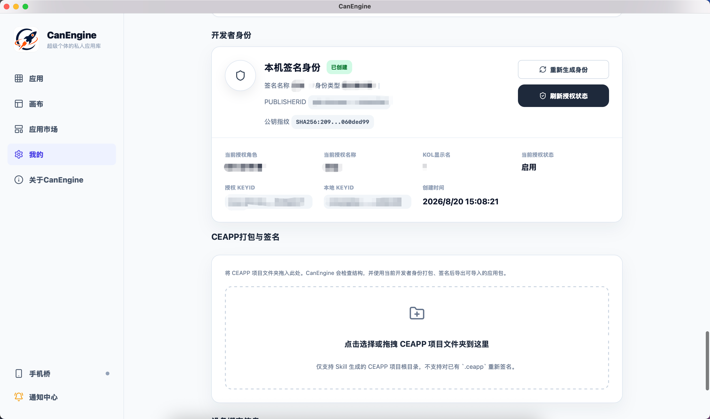
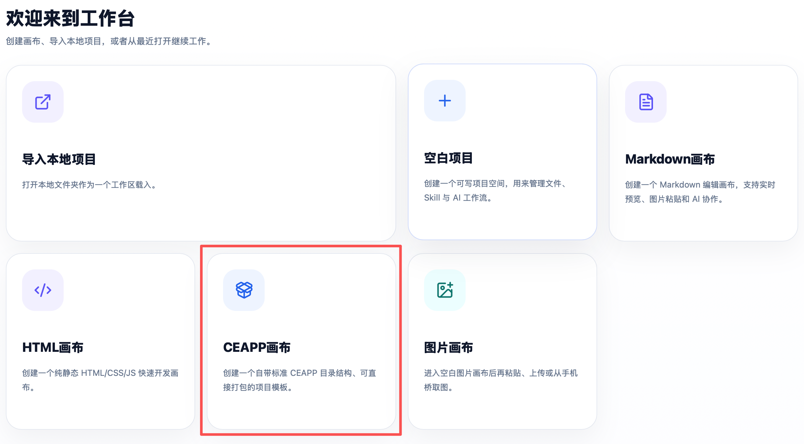

# open-ceapp-creator

用于创建 **CanEngine CEAPP** 的开源 Skill、Starter 模板和验证工具。

它帮助开发者、创作者和 AI 使用者快速生成符合 CanEngine 规范的 CEAPP 项目，包括 `app.json`、HTML、CSS、JavaScript、本地资源、双语结构，以及 AI Bridge、Phone Bridge、Notification Bridge、Data Bridge 等 Host Bridge 接入方式。

完成开发后，可以直接在 CanEngine 中校验、打包和签名，导出 `.ceapp` 应用包。

## CEAPP 是什么

CEAPP 是运行在 CanEngine 中的应用格式。

它可以是一个简单的 HTML 工具，也可以包含 JavaScript、Python、Node.js、本地资源，并按需调用 CanEngine 提供的 AI、文件、数据、通知、设备互传和运行环境能力。

**CanEngine 负责应用运行、授权和宿主能力；CEAPP 负责把已经验证有效的 AI 流程、网页工具或本地工作流封装成可以反复使用的应用。**

## CanEngine 提供的主要能力

[CanEngine（灿引擎）](https://hoyee.net/canengine/) 是连接 AI、电脑文件、个人应用和不同终端的本地工作空间。

CEAPP 可以按需使用以下能力：

- **AI Bridge**：调用文本、图文理解、图像、3D、视频等 AI 能力；模型配置、授权和 API Key 由 CanEngine 管理。
- **MCP Bridge**：连接 ChatGPT、Gemini 等支持 MCP 的 AI 客户端，让 AI 在授权范围内读取和操作 Canvas。当前支持官方原生 MCP 与自定义 MCP，并可分别接入 ChatGPT / Gemini。使用方法：<https://canengine.meeinn.com/mcp>
- **Phone Bridge**：在手机、电脑和 CEAPP 之间传递图片、文档和其他文件。
- **Notification Bridge**：发送即时通知，或注册计划通知能力。
- **Data Bridge**：保存应用私有数据，并按权限访问共享数据。
- **File / Job / Runtime**：选择、暂存、处理、运行和导出本地文件。
- **Locale / Clipboard / Print**：使用宿主语言、剪贴板和打印能力。

产品介绍：<https://hoyee.net/canengine/>

下载 CanEngine：<https://canengine.meeinn.com/download>

## 如何使用这个 Skill

`open-ceapp-creator` 的主要使用场景，是加载到 **Codex、WorkBuddy 等支持 SKILL 的 AI 编程 / Agent 工具** 中，让 AI 按 CEAPP 规范直接创建或修改项目。

也可以在 **CanEngine 中配合 CEAPP Canvas + MCP** 使用：把支持 MCP 的 AI 客户端接入当前 Canvas，让 AI 直接读取和修改 CEAPP 项目，完成后在 CanEngine 中快速校验、打包并导出 `.ceapp` 应用包。

| 使用方式 | 适合场景 | 基本流程 |
|---|---|---|
| **Codex / WorkBuddy 等支持 SKILL 的工具** | 从自然语言需求快速生成 CEAPP，或持续修改现有项目 | 加载 Skill → 指定工作目录 → 描述需求 → AI 生成 / 修改 CEAPP |
| **CanEngine CEAPP Canvas + MCP** | 希望 AI 直接操作当前 CEAPP，并完成从开发到打包的完整流程 | 创建 CEAPP Canvas → 选择 Skill → 通过 MCP 接入 AI → AI 修改 Canvas → 打包导出 `.ceapp` |

<p align="center">
  
</p>

### 方式一：在 Codex、WorkBuddy 等工具中使用

先下载或克隆本项目：

```bash
git clone https://github.com/winshell999/open-ceapp-creator.git
```

然后按照所使用工具的 SKILL 加载方式，把 `open-ceapp-creator` 加入当前 AI 工作环境，并让 AI 在你的 CEAPP 工作目录中执行任务。

例如：

```text
使用 open-ceapp-creator 帮我创建一个图片批量加边框的 CEAPP。
支持本地图片导入、Phone Bridge 导入、批量处理和结果保存。
```

或者直接针对已有项目：

```text
使用 open-ceapp-creator 检查并优化当前 CEAPP。
重点检查 app.json、Host Bridge、Phone Bridge、双语、权限和打包兼容性。
```

AI 会按照本 Skill 的 CEAPP 规范创建或修改项目文件。完成后可以运行仓库中的验证脚本，再把项目交给 CanEngine 打包。

### 方式二：在 CanEngine 中配合 CEAPP Canvas + MCP 使用

如果希望形成完整的 AI 协作开发流程，可以直接在 CanEngine 中使用：

1. 在 CanEngine 的 `我的 → SKILL → 管理 SKILL` 中导入 `open-ceapp-creator`；
2. 创建或打开一个 CEAPP Canvas；
3. 在 AI 指令中选择 `open-ceapp-creator`；
4. 通过 MCP Bridge 将 ChatGPT、Gemini 等支持 MCP 的 AI 客户端连接到当前 Canvas；
5. 直接告诉 AI 要创建或修改什么，AI 可以在授权范围内读取、创建和修改当前 CEAPP 文件；
6. 完成后直接在 CanEngine 中校验、打包和签名，导出 `.ceapp`。

例如：

```text
帮我把当前项目完善成一个可安装的 CEAPP。
补齐双语、Phone Bridge 图片导入、错误状态和 app.json，完成后检查是否可以打包。
```

这种方式适合从需求、开发、调试一直做到最终 `.ceapp` 导出的完整流程，不需要反复在 AI、代码目录和打包工具之间手动搬运内容。

## 快速开始

新建 CEAPP 时，推荐从 `assets/starter/` 开始。

标准结构：

```text
my-app/
├── app.json
├── index.html
├── app.js
├── styles.css
├── assets/
│   ├── ceapp-i18n.js
│   └── logo.png
├── data/                 # 需要本地数据时使用
│   └── localdb.schema.json
└── scripts/              # 需要 Python / Node / 本地任务时使用
```

创建应用时至少需要完成：

1. 设置应用目录名和 `appId`；
2. 设置应用名称、描述和版本；
3. 确保 JavaScript 中的 `APP_ID` 与 `app.json` 一致；
4. 删除不需要的权限和能力；
5. 完成一个可以独立使用的核心流程；
6. 在浏览器中验证纯前端逻辑；
7. 在 CanEngine 中验证真实 Host Bridge；
8. 运行项目验证；
9. 在 CanEngine 中打包并签名。

## Starter 默认包含什么

`assets/starter/` 提供一个最小可运行 CEAPP 起点，包括：

- 本地 HTML / CSS / JavaScript；
- `zh-CN` / `en-US` 双语结构；
- CanEngine 宿主语言同步；
- 本地资源加载；
- app-private Data Bridge 示例；
- 标准 `app.json`；
- 可直接运行的验证结构。

Starter 只是起点。制作真实应用时，应删除未使用的示例、权限和能力。

## 版本与兼容性

项目中常见的版本字段分别表示：

- **CEAPP 应用版本**：`app.json` 中的 `version`，用于标识当前应用版本；
- **最低 CanEngine 版本**：`app.json` 中的 `minCanEngineVersion`，表示运行该应用所需的最低宿主版本；
- **open-ceapp-creator 发布版本**：用于标识本 Skill、Starter 和开发规范的更新版本。

开发自己的 CEAPP 时，只需要根据应用实际变化维护自己的 `version`，并根据所使用的 Host Bridge 能力设置合适的 `minCanEngineVersion`。

## Host Bridge 使用原则

CEAPP 通过 `window.CanEngine` 使用宿主能力。

推荐统一使用：

```js
function getBridge() {
  return window.CanEngine ||
    (window.parent && window.parent.CanEngine) ||
    null
}
```

使用 Host Bridge 时遵循三个原则：

1. **先判断能力是否存在，再调用。**
2. **只申请应用真正需要的权限。**
3. **关键功能必须在 CanEngine 中实际验证。**

不要直接调用 `window.runtime.*`，也不要根据桌面端已有功能猜测一个不存在的 Host Bridge 方法。

详细说明：[`references/manifest-and-host-bridge.md`](./references/manifest-and-host-bridge.md)

## 文件和图片导入

CEAPP 中常见的文件来源包括：

1. 浏览器文件选择器；
2. 粘贴的 `File` / `Blob`；
3. 浏览器 DOM Drag & Drop；
4. Finder / Explorer 原生拖入；
5. Phone Bridge；
6. Job 或其他宿主管理结果文件。

推荐将不同来源统一进入同一个业务处理管线：

```text
picker ───────┐
paste ────────┤
DOM drop ─────┤
host drop ────┼→ normalize/import → validate → preview → app state
Phone Bridge ─┘
```

这样可以避免不同入口出现不同处理结果。

## Phone Bridge

Phone Bridge 用于手机、电脑和 CEAPP 之间的文件传递。

典型流程：

```text
用户点击“从手机导入”
→ CEAPP 记录当前导入目标
→ 建立文件接收流程
→ 打开 Phone Bridge
→ 手机上传文件
→ CEAPP 获得宿主管理的文件引用
→ 读取并校验文件
→ 进入应用自己的处理流程
```

如果一个应用中有多个图片位置，例如“待处理图片”和“Cover 模板”，应在打开 Phone Bridge 前记录明确的 `targetId`，避免文件返回后导入到错误位置。

详细说明：[`references/phone-bridge.md`](./references/phone-bridge.md)

## 外部网页

CEAPP 运行在桌面 WebView 中。

需要打开网页时，优先使用标准 HTTPS 链接：

```html
<a href="https://example.com" target="_blank" rel="noopener noreferrer">
  打开网页
</a>
```

如果未来宿主提供明确的 external-navigation Host Bridge，可以在检测到该能力时优先使用，并保留普通链接作为兼容方式。

## 常见开发问题

| 问题 | 推荐方式 |
|---|---|
| 桌面端有某个功能，CEAPP 是否一定能调用？ | 不一定。以当前 `window.CanEngine` 实际暴露的能力为准 |
| Chrome 中运行正常，是否代表 CEAPP 已完成？ | 不代表。Host Bridge 功能需要在 CanEngine 中测试 |
| Phone Bridge 打开后，文件会自动进入当前图片框吗？ | 不会自动完成业务绑定，应用需要维护明确的导入目标 |
| 所有图片都可以使用 `assetURL()` 吗？ | 不可以。`assetURL()` 主要用于 CEAPP 包内资源 |
| Finder / Explorer 拖入只监听 DOM `drop` 可以吗？ | 不建议，宿主中应同时兼容原生 file-drop bridge |
| 可以直接调用 `window.runtime.*` 吗？ | 不可以，应通过 `window.CanEngine` 公共 Host Bridge |
| Manifest 中多写权限就能获得更多能力吗？ | 不能。权限必须对应宿主已经支持的能力 |
| `getLocale()` 是否一定同步返回？ | 不一定，代码应兼容异步结果 |

更多案例：[`references/ceapp-integration-pitfalls.md`](./references/ceapp-integration-pitfalls.md)

## 项目验证

仓库提供两个验证工具。

### 验证 CEAPP 项目

```bash
python3 scripts/validate_ceapp.py /path/to/ceapp-project
```

会检查：

- `app.json` 是否有效；
- `appId`、入口文件和图标；
- Capability 与 Permission 是否匹配；
- 中英文文案是否完整；
- 是否包含远程启动依赖；
- 是否包含常见敏感文件和路径；
- Starter 结构是否符合 CEAPP 规范。

验证本仓库 Starter：

```bash
python3 scripts/validate_ceapp.py assets/starter
```

### 检查公开仓库

```bash
python3 scripts/audit_public_repo.py
```

用于检查常见的密钥、凭据、私有路径、私有网络地址和不应提交的文件。

GitHub Push / Pull Request 也会自动执行核心验证。

## 项目结构

```text
open-ceapp-creator/
├── .github/workflows/validate.yml
├── agents/openai.yaml
├── assets/
│   ├── readme/                         # README 示例图片
│   └── starter/                        # CEAPP 基础模板
├── references/
│   ├── ceapp-integration-pitfalls.md
│   ├── manifest-and-host-bridge.md
│   ├── phone-bridge.md
│   ├── bilingual-framework.md
│   ├── offline-runtime.md
│   └── packaging-and-signing.md
├── scripts/
│   ├── validate_ceapp.py
│   └── audit_public_repo.py
├── CONTRIBUTING.md
├── SECURITY.md
├── SKILL.md
├── README.md
└── LICENSE
```

## 打包与签名

开发完成并通过验证后，在 CanEngine 中进入 CEAPP 打包与签名功能，选择或拖入 CEAPP 项目根目录。

CanEngine 会完成：

1. 项目检查；
2. CEAPP 打包；
3. 应用来源签名；
4. 导出 `.ceapp` 文件。

<p align="center">
  
</p>

本仓库不保存 API Key、签名私钥或其他发布凭据。

详细说明：[`references/packaging-and-signing.md`](./references/packaging-and-signing.md)

## 参考文档

- [Manifest 与 Host Bridge](./references/manifest-and-host-bridge.md)
- [Phone Bridge](./references/phone-bridge.md)
- [CEAPP 集成常见问题](./references/ceapp-integration-pitfalls.md)
- [双语框架](./references/bilingual-framework.md)
- [离线与 Runtime](./references/offline-runtime.md)
- [打包与签名](./references/packaging-and-signing.md)
- [贡献指南](./CONTRIBUTING.md)
- [安全说明](./SECURITY.md)

## License

本项目使用 [MIT License](./LICENSE)。
